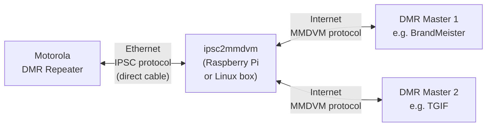

# ipsc2mmdvm

[](https://github.com/USA-RedDragon/ipsc2mmdvm/actions/workflows/release.yaml) [](https://github.com/USA-RedDragon/ipsc2mmdvm) [](https://goreportcard.com/report/github.com/USA-RedDragon/ipsc2mmdvm) [](https://github.com/USA-RedDragon/ipsc2mmdvm/blob/main/LICENSE) [](https://github.com/USA-RedDragon/ipsc2mmdvm/releases/) [](https://codecov.io/gh/USA-RedDragon/ipsc2mmdvm)

**Connect your Motorola IPSC repeater to MMDVM DMR Masters.**

ipsc2mmdvm is a protocol bridge that translates between Motorola's IP Site Connect (IPSC) protocol and the MMDVM Protocol. This lets your IPSC-only repeater talk to one or more DMR masters such as BrandMeister and TGIF simultaneously, with [DMRGateway](https://github.com/g4klx/DMRGateway)-compatible rewrite rules for routing talkgroups between networks.

## How It Works



Your repeater connects directly via Ethernet cable to the box running ipsc2mmdvm. The software acts as an IPSC master to the repeater and forwards voice and data traffic to and from one or more DMR masters over the internet. DMRGateway-style rewrite rules let you route specific talkgroups to specific masters.

## Requirements

- A **Motorola IPSC-capable DMR repeater**
- A **Raspberry Pi** (any model with Wi-Fi and an Ethernet port) or any **Linux box with a spare NIC**
- An **Ethernet cable** to connect the repeater directly to the Pi/Linux box
- **Internet access** on the Pi/Linux box (via Wi-Fi on a Raspberry Pi, or a second NIC on a Linux box)
- A **DMR Master** with a registered repeater ID to connect to (e.g. BrandMeister)

## Setup

### 1. Download ipsc2mmdvm

Download the latest release tarball for your platform from the [GitHub Releases](https://github.com/USA-RedDragon/ipsc2mmdvm/releases/latest) page. For a Raspberry Pi, grab the [`linux_arm64`](https://github.com/USA-RedDragon/ipsc2mmdvm/releases/latest) build, for desktop Linux use [`linux_amd64`](https://github.com/USA-RedDragon/ipsc2mmdvm/releases/latest). Extract it and move the binary to your PATH:

```bash
tar xzf ipsc2mmdvm_*_linux_arm64.tar.gz
sudo mv ipsc2mmdvm /usr/local/bin/ipsc2mmdvm
```

### 2. Create the Config File

Download the example config, edit it, then move it into place:

```bash
wget https://raw.githubusercontent.com/USA-RedDragon/ipsc2mmdvm/main/config.example.yaml -O ipsc2mmdvm.yaml
nano ipsc2mmdvm.yaml
sudo mv ipsc2mmdvm.yaml /etc/ipsc2mmdvm.yaml
```

Here is the full example config with comments:

```yaml
log-level: info

ipsc:
  interface: "eth0"       # The network interface connected to your repeater
  port: 50000             # UDP port the repeater will connect to
  ip: "10.10.250.1"       # IP address assigned to the interface (must match repeater's Gateway IP)
  subnet-mask: 24         # Subnet mask (24 = 255.255.255.0)
  auth:
    enabled: false        # Set to true if you configured an auth key in CPS
    key: ""               # Hex string, up to 40 characters (must match CPS)

mmdvm:
  - name: "BrandMeister"  # Friendly name for logging
    master-server: "3104.master.brandmeister.network:62031"  # BrandMeister master (see below)
    password: "passw0rd"  # Your BrandMeister hotspot password

    callsign: N0CALL      # Your callsign
    radio-id: 123456789   # Your registered repeater DMR ID

    # Frequencies in Hz:
    rx-freq: 429075000
    tx-freq: 424075000

    color-code: 7         # Must match your repeater's color code (0-15)

    # Optional, reported to BrandMeister:
    # latitude: 30.000000
    # longitude: -97.000000
    height: 3             # Antenna height in meters
    location: "My City, ST"
    # description: ""
    # url: ""

    # Rewrite rules (optional, DMRGateway-compatible)
    # tg-rewrite:
    #   - from-slot: 1
    #     from-tg: 9
    #     to-slot: 1
    #     to-tg: 9
    #     range: 1

  # Add more masters for multi-network support:
  # - name: "TGIF"
  #   master-server: "tgif.network:62031"
  #   password: "secret"
  #   callsign: N0CALL
  #   radio-id: 123456789
  #   rx-freq: 429075000
  #   tx-freq: 424075000
  #   color-code: 7
  #   height: 3
  #   tg-rewrite:
  #     - from-slot: 2
  #       from-tg: 31665
  #       to-slot: 2
  #       to-tg: 31665
  #       range: 1
```

**Config notes:**

- **`ipsc.interface`** - The name of the network interface physically connected to your repeater. On a Raspberry Pi this is typically `eth0`. Run `ip link` to see your interface names.
- **`ipsc.ip`** - The IP address ipsc2mmdvm assigns to that interface. This becomes the "Master IP" in your repeater's CPS config, and also the gateway for the repeater. Pick any private IP (e.g. `10.10.250.1`).
- **`ipsc.port`** - The UDP port to listen on. The default `50000` works fine. Must match the "Master UDP Port" in CPS.
- **`mmdvm`** - A YAML array of DMR master connections. Each entry is a separate master. You can connect to as many masters as you like.
- **`mmdvm[].name`** - A friendly name for this network, used in log messages (e.g. `"BrandMeister"`, `"TGIF"`).
- **`mmdvm[].master-server`** - The master's host and port. For BrandMeister, find the master covering your region in the [BrandMeister Master Server List](https://brandmeister.network/?page=masters). The format is `host:port` (e.g. `3104.master.brandmeister.network:62030`).
- **`mmdvm[].password`** - Your hotspot security password, such as the one set in your BrandMeister self-care dashboard.
- **`mmdvm[].radio-id`** - Your repeater's DMR ID, registered at [radioid.net](https://radioid.net/).

### 3. Configure the Motorola Repeater (CPS)

Open your repeater's codeplug in the **Motorola Customer Programming Software (CPS)** and make the following changes:

> **Important:** You must enable **Expert Mode** first: go to **View → Expert** in the CPS menu bar.

#### Network Settings

|       Setting       |                              Value                               |
| ------------------- | ---------------------------------------------------------------- |
| **DHCP**            | **Disabled**                                                     |
| **Ethernet IP**     | A static IP on the same subnet as `ipsc.ip` (e.g. `10.10.250.2`) |
| **Gateway IP**      | The `ipsc.ip` value from your config (e.g. `10.10.250.1`)        |
| **Gateway Netmask** | Matching your `subnet-mask` (e.g. `255.255.255.0` for `/24`)     |

#### Link Establishment

|        Setting         |                                                              Value                                                              |
| ---------------------- | ------------------------------------------------------------------------------------------------------------------------------- |
| **Link Type**          | **Peer**                                                                                                                        |
| **Master IP**          | The `ipsc.ip` value from your config (e.g. `10.10.250.1`)                                                                       |
| **Master UDP Port**    | The `ipsc.port` value from your config (e.g. `50000`)                                                                           |
| **Authentication Key** | *(Optional)* Up to 40 hex characters. If set, enable `ipsc.auth.enabled` and put the same key in `ipsc.auth.key` in the config. |

Write the codeplug to the repeater.

### 4. Connect the Hardware

1. **Plug an Ethernet cable** directly from your repeater's Ethernet port to the Ethernet port on your Raspberry Pi (or spare NIC on your Linux box).
2. Make sure the Pi/Linux box has **internet access** through a different interface (Wi-Fi on a Pi, or a second NIC).

> **Note:** The Ethernet interface connected to the repeater is dedicated to ipsc2mmdvm. Do not use it for anything else, ipsc2mmdvm will assign it an IP address automatically.

### 5. Run ipsc2mmdvm

ipsc2mmdvm requires root privileges to configure the network interface. Run it from the directory containing your config file, or copy the config to the working directory:

```bash
sudo ipsc2mmdvm
```

By default, ipsc2mmdvm looks for `config.yaml` in the current directory. You can also place the config at a known location and run from that directory:

```bash
cd /etc && sudo ipsc2mmdvm
```

On startup you should see the repeater register and traffic will begin flowing to BrandMeister.

### Running as a systemd Service

To have ipsc2mmdvm start automatically on boot, create a systemd service file:

```bash
sudo tee /etc/systemd/system/ipsc2mmdvm.service << 'EOF'
[Unit]
Description=ipsc2mmdvm - IPSC to MMDVM Bridge
After=network-online.target
Wants=network-online.target

[Service]
Type=simple
WorkingDirectory=/etc
ExecStart=/usr/local/bin/ipsc2mmdvm -config /etc/ipsc2mmdvm.yaml
Restart=on-failure
RestartSec=5

[Install]
WantedBy=multi-user.target
EOF
```

Then enable and start it:

```bash
sudo systemctl daemon-reload
sudo systemctl enable ipsc2mmdvm
sudo systemctl start ipsc2mmdvm
```

Check status and logs:

```bash
sudo systemctl status ipsc2mmdvm
sudo journalctl -u ipsc2mmdvm -f
```

## Configuration Reference

All settings can also be set via **environment variables** using `_` as a separator (e.g. `IPSC_PORT=50000`).

### General

|   Setting   |  Type  | Default |                   Description                   |
| ----------- | ------ | ------- | ----------------------------------------------- |
| `log-level` | string | `info`  | Log verbosity: `debug`, `info`, `warn`, `error` |

### IPSC

|       Setting       |  Type  |    Default    |                 Description                 |
| ------------------- | ------ | ------------- | ------------------------------------------- |
| `ipsc.interface`    | string | -             | Network interface connected to the repeater |
| `ipsc.port`         | uint16 | -             | UDP listen port                             |
| `ipsc.ip`           | string | `10.10.250.1` | IP address to assign to the interface       |
| `ipsc.subnet-mask`  | int    | `24`          | CIDR subnet mask (1–32)                     |
| `ipsc.auth.enabled` | bool   | `false`       | Enable IPSC authentication                  |
| `ipsc.auth.key`     | string | -             | Hex authentication key (up to 40 chars)     |

### MMDVM (array — one entry per DMR master)

|         Setting         |  Type   | Default |                   Description                    |
| ----------------------- | ------- | ------- | ------------------------------------------------ |
| `mmdvm[].name`          | string  | -       | Friendly name for this network (used in logging) |
| `mmdvm[].master-server` | string  | -       | DMR master `host:port`                           |
| `mmdvm[].password`      | string  | -       | Hotspot password                                 |
| `mmdvm[].callsign`      | string  | -       | Your amateur radio callsign                      |
| `mmdvm[].radio-id`      | uint32  | -       | Your registered DMR repeater ID                  |
| `mmdvm[].rx-freq`       | uint    | -       | Receive frequency in Hz                          |
| `mmdvm[].tx-freq`       | uint    | -       | Transmit frequency in Hz                         |
| `mmdvm[].tx-power`      | uint8   | `0`     | Transmit power in dBm                            |
| `mmdvm[].color-code`    | uint8   | `0`     | DMR color code (0–15)                            |
| `mmdvm[].latitude`      | float64 | `0`     | Latitude (−90 to +90)                            |
| `mmdvm[].longitude`     | float64 | `0`     | Longitude (−180 to +180)                         |
| `mmdvm[].height`        | uint16  | `0`     | Antenna height in meters                         |
| `mmdvm[].location`      | string  | -       | Location description                             |
| `mmdvm[].description`   | string  | -       | Repeater description                             |
| `mmdvm[].url`           | string  | -       | Repeater URL                                     |

### Rewrite Rules (per MMDVM entry, optional)

Rewrite rules control how DMR traffic is routed between the repeater and each master. They follow the same semantics as [DMRGateway](https://github.com/g4klx/DMRGateway): the first matching rule wins. If no rewrite rules are configured for a master, all traffic passes through unmodified.

#### TGRewrite — remap group talkgroup calls

|             Setting              | Type | Default |           Description           |
| -------------------------------- | ---- | ------- | ------------------------------- |
| `mmdvm[].tg-rewrite[].from-slot` | uint | -       | Source timeslot (1 or 2)        |
| `mmdvm[].tg-rewrite[].from-tg`   | uint | -       | Source talkgroup start          |
| `mmdvm[].tg-rewrite[].to-slot`   | uint | -       | Destination timeslot (1 or 2)   |
| `mmdvm[].tg-rewrite[].to-tg`     | uint | -       | Destination talkgroup start     |
| `mmdvm[].tg-rewrite[].range`     | uint | `1`     | Number of contiguous TGs to map |

#### PCRewrite — remap private calls by destination ID

|             Setting              | Type | Default |            Description            |
| -------------------------------- | ---- | ------- | --------------------------------- |
| `mmdvm[].pc-rewrite[].from-slot` | uint | -       | Source timeslot (1 or 2)          |
| `mmdvm[].pc-rewrite[].from-id`   | uint | -       | Source private call ID start      |
| `mmdvm[].pc-rewrite[].to-slot`   | uint | -       | Destination timeslot (1 or 2)     |
| `mmdvm[].pc-rewrite[].to-id`     | uint | -       | Destination private call ID start |
| `mmdvm[].pc-rewrite[].range`     | uint | `1`     | Number of contiguous IDs to map   |

#### TypeRewrite — convert group TG calls to private calls

|              Setting               | Type | Default |             Description             |
| ---------------------------------- | ---- | ------- | ----------------------------------- |
| `mmdvm[].type-rewrite[].from-slot` | uint | -       | Source timeslot (1 or 2)            |
| `mmdvm[].type-rewrite[].from-tg`   | uint | -       | Source talkgroup start              |
| `mmdvm[].type-rewrite[].to-slot`   | uint | -       | Destination timeslot (1 or 2)       |
| `mmdvm[].type-rewrite[].to-id`     | uint | -       | Destination private call ID start   |
| `mmdvm[].type-rewrite[].range`     | uint | `1`     | Number of contiguous entries to map |

#### SrcRewrite — match calls by source, remap source ID

|              Setting              | Type | Default |           Description           |
| --------------------------------- | ---- | ------- | ------------------------------- |
| `mmdvm[].src-rewrite[].from-slot` | uint | -       | Source timeslot (1 or 2)        |
| `mmdvm[].src-rewrite[].from-id`   | uint | -       | Source subscriber ID start      |
| `mmdvm[].src-rewrite[].to-slot`   | uint | -       | Destination timeslot (1 or 2)   |
| `mmdvm[].src-rewrite[].to-id`     | uint | -       | Destination source ID start     |
| `mmdvm[].src-rewrite[].range`     | uint | `1`     | Number of contiguous source IDs |
